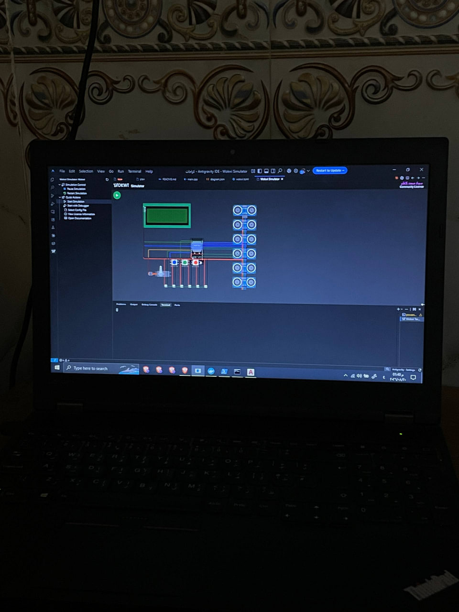
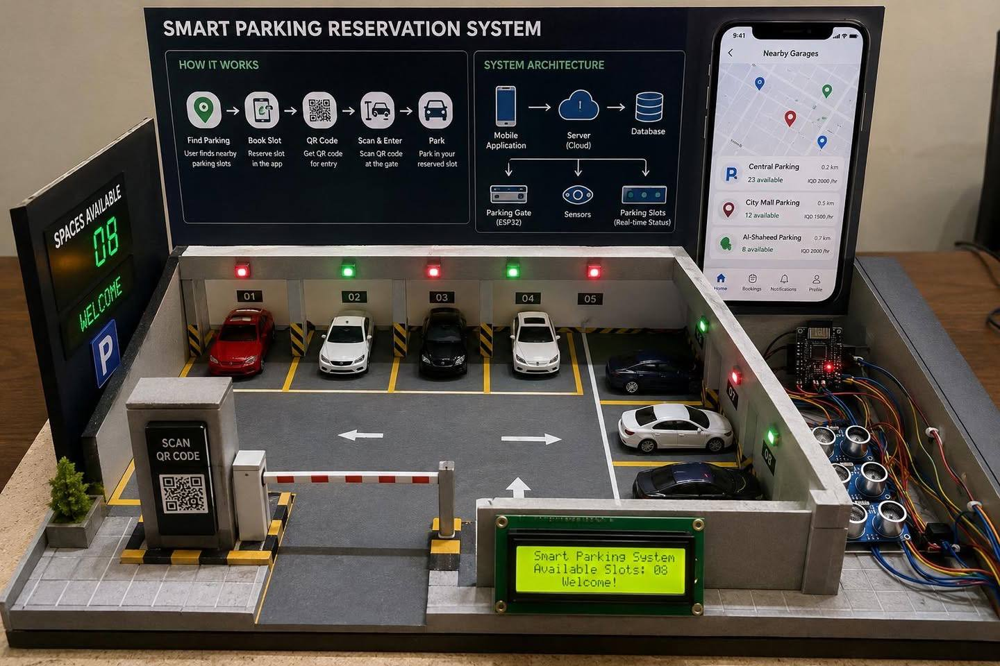

# Smart Parking Reservation System — Graduation Project

**Version:** v1.0.0




## 📖 Overview

This repository contains the complete source code, configuration, and hardware schematics for a comprehensive, full-stack IoT Smart Parking Reservation System. Developed as a graduation project, it integrates a mobile application, a backend server, software simulators, and physical ESP32 firmware.

As shown in the physical model image above, the system architecture includes:
- **Mobile Application (Expo/React Native):** An intuitive app for users to find nearby garages, book parking slots, and receive a QR code for entry. It also includes an administrative interface.
- **Backend Server (Supabase/PostgreSQL):** A robust cloud (or local) backend that handles user authentication, real-time database management, and edge functions.
- **IoT Hardware (ESP32):** The physical garage utilizes an ESP32 microcontroller, ultrasonic sensors (to monitor slot availability in real-time), an entry gate barrier, an LCD display for garage status, and a QR code scanner for secure access.
- **Hardware Simulator & Wokwi:** Includes a CLI simulator and a Wokwi diagram (with 6 virtual slots) for testing system logic without the physical hardware.
- **Firmware (PlatformIO):** Custom C++ firmware for the ESP32 to handle sensor data, gate control, and secure communication with the backend.

---

## 🛠️ Getting Started

Follow the instructions below to set up the development environment and run the system locally.

### 1. Local Backend Setup (Supabase)

1. Ensure **Docker Desktop** is installed and running on your machine.
2. Copy `.env.example` to the appropriate `.env` files and populate them with secure, unique secrets.
3. Start the local Supabase environment by running:

```powershell
npx supabase start
npx supabase db reset
npx supabase functions serve --env-file supabase/.env.local
```

**Important:** You must create a `supabase/.env.local` file containing the following secrets: `PII_ENCRYPTION_KEY`, `PII_HMAC_KEY`, and `DEVICE_MASTER_SECRET`. 
*Note: The local Supabase environment is strictly for development and should not be exposed to the internet.*

### 2. Mobile App Setup (Expo)

1. Copy `mobile/.env.example` to `mobile/.env`.
2. Run `npx supabase status` to retrieve your local API URL and anon key, then update your `mobile/.env` file accordingly.
3. Install dependencies and start the app:

```powershell
cd mobile
npm install
npm run mobile
```

**Device Connectivity Notes:**
- **Android Emulator:** Use the appropriate host IP address (e.g., `10.0.2.2`) instead of `127.0.0.1`.
- **Physical Device:** Use your computer's local network IP address. Both your laptop and phone must be on the same Wi-Fi network.
- For final production deployment, the app should be configured to point to a cloud-hosted Supabase project.

### 3. Admin Account & QR Code Generation

To generate the entry QR code and create an administrator account, run the following commands (replace values as needed):

```powershell
$env:SUPABASE_URL='http://127.0.0.1:55321'
$env:SUPABASE_SECRET_KEY='<local-secret-key-from-supabase-status>'
$env:ADMIN_EMAIL='admin@example.com'
$env:ADMIN_PASSWORD='a-strong-demo-password'

npm run admin:create
npm run qr
```

This script will generate a QR code at `docs/gate-entry-qr.svg`, which contains the unique identifier for the parking gate.

### 4. Hardware Simulator

If you are developing without the physical ESP32 setup, you can use the software simulator.

1. Copy `simulator/.env.example` to `simulator/.env`.
2. Ensure that `DEVICE_MASTER_SECRET` matches the one used in your Supabase configuration.
3. Start the simulator:

```powershell
npm run simulator
```

**Available Commands:**
Try interacting with the simulator by typing: `slot 1 occupied`, `slot 1 free`, `entry`, `exit`, `offline`, and `online`.

### 5. ESP32 Firmware & Wokwi Simulation

For detailed hardware instructions, please refer to the [Firmware Instructions](firmware/README.md) and [Hardware Wiring Guide](docs/HARDWARE.md).

**To build the firmware:**
1. Ensure [PlatformIO](https://platformio.org/) is installed.
2. Run the build command:

```powershell
cd firmware
pio run
```

**Wokwi:**
You can open `firmware/diagram.json` using the Wokwi simulator. 
*Security Warning: Never place production keys or secrets inside a public Wokwi project.*

### 6. Verification and Testing

Ensure your setup is working correctly and code is error-free by running:

```powershell
npm run typecheck
npm test
npx expo install --check
```

*Note on `npm audit`: You may see audit warnings related to the current Expo/Metro toolchain. Automated fixes may downgrade Expo to an incompatible version. It is recommended to wait for an official compatible update rather than running `npm audit fix --force`.*

---

## 📚 Architecture & Security

For an in-depth understanding of the system's trust model, protocol design, and overall structure, please review the [ARCHITECTURE.md](docs/ARCHITECTURE.md) document.
